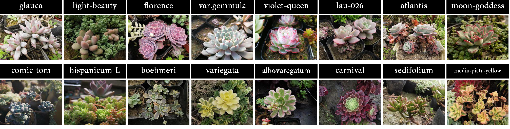

<!--
 * @Author: shuoye
 * @Date: 2023-06-09 11:47:01
 * @LastEditors: shuoye
 * @LastEditTime: 2024-10-24 10:42:27
 * @Description: file content
 * Copyright 2023 shuoye, All Rights Reserved.
-->
# Description

[Paper Link](https://xxxxxxxxxxx.pdf)

CDLT is a benchmark dataset for fine-grained visual categorization. It starts from the real-world conditions and aims to promote the practical progress of FGVC. The dataset is collected by gathering 11195 images of 250 instances in different species for 47 consecutive months in their natural contexts.  The collection process involves dozens of crowd workers for photographing and domain experts for labeling. 
we present a Concept Drift and Long-Tailed Distribution dataset.   

It can be applied to related tasks such as <font color=Blue>Fine-grained visual categorization</font>, <font color=Blue>Long-tail distribution learning</font>, and <font color=Blue>Single-domain generalization learning</font>.

* Download Link: [谷歌云盘地址]()

## Description

现有细粒度数据集的总结

但是它们没有考虑 长尾分布、域漂移问题，为此，我们构建了Duorou数据集.



## Dataset Construction

Duorou数据集包含哪些内容（比如：xxx、xxx等99个不同纲-属-种的鸟类图片，以及图片数量、图片）

我们是怎么收集/整理/构建/完善这个数据集的

我们发布的Duorou数据集的具体形式，包括：包含那些文件夹/文件？是怎么组织的，图片的命名方式，序号的含义（文件夹名称和类别的关系）等，<!--  以方便他人下载了Duorou数据集不蒙知道是啥-->

We may update our data in the future to improve its diversity

<!-- 具体的实验设置和展示，可以放多张图片/表格，比如train/test数量等细节 -->


## Benchmark

基准实验的图片展示

<!-- 跑的实验结果的展示，不同方法和其他数据集跑的基准实验 -->


## Citation and Contact

Please consider to cite our paper when you use our dataset.

**NOTE**: The dataset can only be used for non-commercial purposes!

```
@InProceedings{,
    author    = {},
    title     = {},
    booktitle = {},
    month     = {},
    year      = {},
    pages     = {}
}
```

For any questions about this database please contact the author below.

```
{Shuo Ye}
E-mail: {作者邮箱}
```
