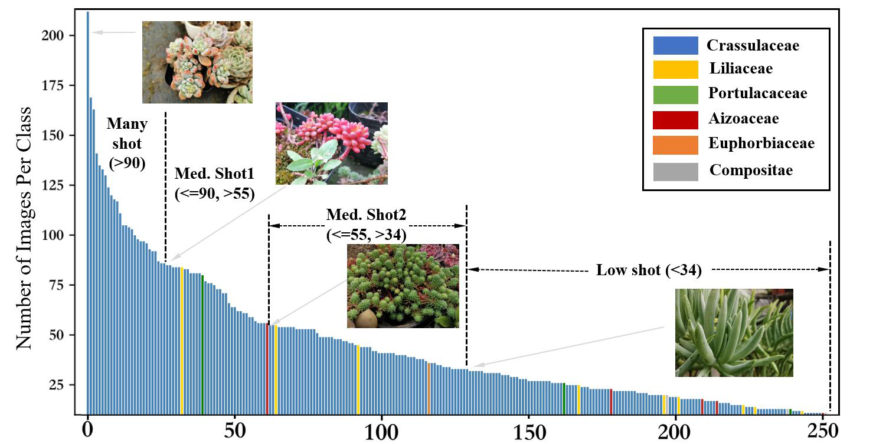

<!--
 * @Author: shuoye
 * @Date: 2023-06-09 11:47:01
 * @LastEditors: shuoye
 * @LastEditTime: 2024-10-30 10:41:44
 * @Description: file content
 * Copyright 2023 shuoye, All Rights Reserved.
-->
## Description

[Paper Link](https://xxxxxxxxxxx.pdf)

CDLT is a benchmark dataset for fine-grained visual categorization. It starts from the real-world conditions and aims to promote the practical progress of FGVC. The dataset is collected by gathering 11195 images of 250 instances in different species for 47 consecutive months in their natural contexts.  The collection process involves dozens of crowd workers for photographing and domain experts for labeling.  

CDLT can be applied to related tasks such as 
<font color=Blue>Fine-grained visual categorization</font>, 
<font color=Blue>Long-tail distribution learning</font>,  
<font color=Blue>Single-domain generalization learning</font>.

 

 * Download Link: [谷歌云盘地址]()
---
## Challenges
### Concept Drift
- Concept drift can be distinguished as four types according to the variation form of the instance: sudden, incremental, recurring, and gradual, as shown in Figure 2 (a). 

- The types of drift in CDLT not only include incremental and sudden, but also has periodic drift which is different from recurring, and instead indicates repeated conversion in regular intervals, as shown in Figure 2 (b).


Figure 2. Examples of different concept drift types. Red and blue represent two different concepts, while the light color represents the intermediate concept which appears during the transformation from one to another.


Figure 3. A visual representation of different types of data drift.

### Long-tail Distribution 
Two special issues should be considered:

- There is often similarity between head and tail classes, despite the fact that most long-tailed datasets define hard boundaries between classes. For example, when the head class is 'house' and the tail class is 'tree.' However, in FGVC, there may still be significant similarity between the head and tail data.

- The sampled datasets struggle to simulate the real distribution in natural scenes, which limits the practical deployment of FGVC algorithms in real-world applications. In contrast, the proposed dataset is collected from real-world scenarios, naturally exhibiting a true long-tailed distribution.


---
## Dataset Construction
When multiple instances appear in an image, we follow that the cropped image contains no more than 3 instances that belong to the same subclass. In this way, we obtain 14512 samples in total.  Rather than releasing all the samples, 11195 samples are selected to be included in the final dataset, while each sub-class contains at least 10 images.  The remaining samples are held in reserve in case we encountered unforeseen problems when using this dataset. All the images are resized to have a maximal dimension of 1200px.

Two versions of the CDLT dataset in use.
- CDLT. It can be used for general FGVC tasks or long-tail distribution research. Both Training set and Test set contains data from the entire year.
- CDLT-cd. It is specifically designed for concept drift research.  Training set contains data from a single season, while the Test set covers data from the entire year.
**NOTE**:Not every subclass has a significant periodic drift with the seasons.  So the other subclasses in this training set, we only include divide out instances those with significant concept drift.

 <!-- To avoid discrepancies in results due to differences in the amount of training data, the data scale for both training modes in CDLT-cd is consistent.  -->
---
## Benchmark

### VLMs in Long-Tailed Distributions
We use the results obtained by loading only the pre-trained parameters without any additional training as the pre-training baseline, obtaining only the number of classes in each dataset as prior knowledge. This approach aims to evaluate the performance of the model’s pre-trained knowledge across different visual concepts. Fine-tuning of CLIP is implemented by adding an Adapter to the text encoder. During training, a similarity matrix is calculated using the visual features of the current batch and the text features of all classes, with irrelevant text, such as label codes (e.g., n365697), removed from the dataset labels.


It can be observed that the pre-trained knowledge is already sufficient to handle many common fine-grained targets.  After fine-tuning, accuracy improves across four datasets;  however, it decreases on the Stanford Cars and CDLT datasets.

We further visualized the model's results for each subclass, The model performs remarkably on well-defined visual concepts, such as ``African hunting dog" in the Stanford Dogs dataset, achieving a classification accuracy of 92\% during testing.  However, it demonstrates catastrophic misinterpretation on more ambiguous subclasses, like ``redbone," with a test classification accuracy of only 0.09\%.

One reason for this phenomenon is that fine-grained labels often involve highly detailed descriptions to differentiate between categories.  These descriptions are relatively uncommon and require a certain level of expertise, frequently involving various abbreviations.  Additionally, the minimal differences between labels may hinder the model’s ability to extract precise category information.


Further analysis confirms that the fine-tuning process adjusts the model parameters to optimize overall accuracy.  The model focuses on improving performance for categories that performed poorly on the training data, thereby avoiding the 'memorization' of certain feature patterns in the pre-trained knowledge.  This approach alleviates the overfitting issues encountered during the upstream learning process.

However, when the dataset exhibits a long-tailed distribution, CLIP's performance shows certain biases.  Fine-tuning has not significantly improved the recognition of categories with fewer samples, as tail-end subclasses are not sufficiently learned, making it challenging for the model to establish connections between these category labels and their semantic features.  The reallocated weights may gradually shift the model's focus towards head classes, resulting in a 'dilution' of overfitted knowledge, while newly formed associations fall short of supporting accurate category learning, ultimately leading to a decline in overall performance.


Our visualization reveals three key insights:

(1) The pre-trained knowledge in VLMs is imbalanced for fine-grained tasks, showing significant performance disparities across different visual concepts.

(2) Long-tailed distributions exacerbate the learning difficulty for VLMs, resulting in stronger performance on common concepts and weaker performance on rare ones.

(3) This explains why recent generation-based large models tend to produce peculiar errors when applied to FGVC tasks.

### ACKNOWLEDGMENT
Thanks to Hongyu Ke, Ming Ma, Yue Li, Hao Men, Manqin Wen, Haodong Zhang, Ziyi Zhang, XunZhu, Yue Wu, Wenjin Hou, Mingxin Liao, Jiaqi Jiang, Huimin Xu, Ziming Hong, Shuhuang Chen, Yuxuan Zheng and Wenzhou Chen for their contributions in the data collection process.


## Dataset Construction

我们发布的Duorou数据集的具体形式，包括：包含那些文件夹/文件？是怎么组织的，图片的命名方式，序号的含义（文件夹名称和类别的关系）等，<!--  以方便他人下载了Duorou数据集不蒙知道是啥-->

We may update our data in the future to improve its diversity

<!-- 具体的实验设置和展示，可以放多张图片/表格，比如train/test数量等细节 -->


基准实验的图片展示

<!-- 跑的实验结果的展示，不同方法和其他数据集跑的基准实验 -->


## Citation

Please consider to cite our paper when you use our dataset.
- If you are interested in the experiments on the CDLT dataset, you can partially refer to the following work.

```
@article{YE2023103837,
title = {Coping with change: Learning invariant and minimum sufficient representations for fine-grained visual categorization},
author = {Shuo Ye and Shujian Yu and Wenjin Hou and Yu Wang and Xinge You},
journal = {Computer Vision and Image Understanding},
volume = {237},
pages = {103837},
year = {2023},
issn = {1077-3142},
doi = {https://doi.org/10.1016/j.cviu.2023.103837},
}
```
**NOTE**: The dataset can only be used for non-commercial purposes!
<!-- For any questions about this database please contact the author below.

```
{Shuo Ye}
E-mail: {作者邮箱}
``` -->
